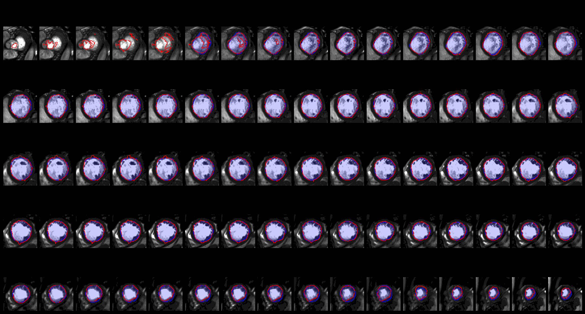

# Optical Flow-Guided Cine MRI Segmentation with Learned Corrections

[](https://www.python.org/downloads/release/python-3100/)
[](https://pytorch.org/)
[](LICENSE)

Official implementation of **"Optical Flow-Guided Cine MRI Segmentation with Learned Corrections"** (IEEE Transactions on Medical Imaging).

This method automates the propagation of arbitrary regions of interest (ROIs) along the cardiac cycle from expert annotations provided at two time points (typically end-systolic and end-diastolic phases). A 3D TV-$L^1$ optical flow algorithm computes the apparent motion between consecutive MRI frames in both forward and backward directions. The resulting bidirectional flow fields propagate the annotated masks across all cardiac phases, and a lightweight 3D U-Net refines these initial estimates using a novel loss function that enforces forward–backward consistency without requiring dense ground-truth labels.



## Key Features

- **Versatile ROI Segmentation** — Works with *any* anatomical structure (single ventricle, left/right ventricle, myocardium, etc.) given annotations at two time points
- **3D TV-$L^1$ Optical Flow** — Anisotropic Huber-type TV regularization with multi-scale coarse-to-fine pyramid, solved via primal-dual proximal splitting, implemented as custom CUDA kernels
- **Bidirectional Propagation** — Forward (ED→ES) and backward (ES→ED) mask warping using tricubic Hermite-spline interpolation
- **Lightweight 3D U-Net Post-processing** — Residual learning with only 1.4M parameters; trained with a novel loss combining supervised, self-supervised consistency, and penalization terms
- **Patient-Specific Fine-Tuning** — The self-supervised loss enables fine-tuning on a single patient (100 Adam steps), yielding state-of-the-art results across the complete cardiac cycle
- **Multi-GPU Parallel Processing** — Optical flow computation distributed across GPUs for large datasets
- **Modular Preprocessing** — Configurable pipeline: spatial cropping, isotropic resampling (80³), patient-wise nonlinear intensity normalization, and train/val splitting

## Pipeline Overview

```
Cine MRI + Expert Masks at ED & ES
    │
    ▼
┌─────────────────────────────────────────────┐
│  Preprocessing                              │
│  setup → crop → resample (80³) →            │
│  normalize → train/val split                │
└─────────────────┬───────────────────────────┘
                  │
                  ▼
┌─────────────────────────────────────────────┐
│  3D TV-L¹ Optical Flow (CUDA)              │
│  Forward Φ(k,k+1) & Backward Φ(k+1,k)     │
│  Anisotropic TV + primal-dual solver        │
└─────────────────┬───────────────────────────┘
                  │
                  ▼
┌─────────────────────────────────────────────┐
│  Mask Propagation via Warping               │
│  m→(k+1) = W(m→(k), Φ(k,k+1))             │
│  m←(k)   = W(m←(k+1), Φ(k+1,k))           │
└─────────────────┬───────────────────────────┘
                  │
                  ▼
┌─────────────────────────────────────────────┐
│  3D U-Net Refinement (PyTorch Lightning)    │
│  m†(k) = m(k) + f_θ(m(k), i(k))           │
│  Loss: supervised + self-supervised +       │
│        penalization                         │
└─────────────────┬───────────────────────────┘
                  │
                  ▼
    Refined Segmentation Masks (all phases)
```

## Datasets

The method is evaluated on two cardiac cine MRI datasets:

- **ACDC** ([Automatic Cardiac Diagnosis Challenge](https://www.creatis.insa-lyon.fr/Challenge/acdc/)): 150 patients with annotations for left ventricle (LV), right ventricle (RV), and myocardium (MY) at ED and ES phases. 100 training / 50 test split.
- **SVD** (Single Ventricle Dataset): 90 patients with single ventricle pathology acquired at University Hospital Bonn. Covers children (0–5 yrs), adolescents (6–17 yrs), and adults (≥18 yrs). 3 patients are fully annotated at every time point for evaluation.

## Requirements

- Linux (CUDA extension build requires Linux)
- NVIDIA GPU with CUDA 11.8+
- Conda (Miniconda or Anaconda)

## Installation

1. **Clone the repository:**

    ```bash
    git clone <repository-url>
    cd singleVentricleSegmentation
    ```

2. **Create the conda environment:**

    ```bash
    conda env create -f environment.yaml
    conda activate svs
    ```

    This installs Python 3.10, PyTorch 2.1, CUDA 11.8, PyTorch Lightning, MONAI, and all other dependencies.

3. **Build the CUDA extension:**

    The package installs in editable mode (`-e .`) via `environment.yaml`. If you need to rebuild manually:

    ```bash
    pip install -e .
    ```

    This compiles the custom CUDA kernels for optical flow, warping, and prolongation operations into `opticalFlow_cuda_ext/`.

## Usage

All configuration files are in the `conf/` directory. The pipeline has four main stages:

### 1. Preprocessing

The ACDC dataset contains 3 ROIs (left ventricle, right ventricle, myocardium) that must be separately extracted and preprocessed. Configure paths in `conf/setup_acdc.yaml` and `conf/preprocessing.yaml`.

**All-in-one** — runs all preprocessing steps sequentially:

```bash
python scripts/acdc_preprocessing_pipeline.py
```

**Step-by-step** — run each stage independently:

```bash
# 1. Reformat raw ACDC data into project structure
python svs/preprocessing/setup_acdc.py

# 2. Crop volumes to ROI bounding boxes
python svs/preprocessing/cutting.py

# 3. Resize to uniform dimensions (80×80×80) and pad to 35 frames
python svs/preprocessing/prolongation.py

# 4. Normalize intensity values
python svs/preprocessing/normalization.py

# 5. Split into train/validation sets
python svs/preprocessing/split.py
```

### 2. Optical Flow Computation

Compute 3D TV-L1 optical flow fields between consecutive cardiac frames. Configure parameters in `conf/flow.yaml`.

**Single GPU:**

```bash
python scripts/flow.py
```

**Multi-GPU parallel** — distributes forward/backward flow computation across GPUs:

```bash
chmod +x scripts/parallel_flow.sh
./scripts/parallel_flow.sh
```

Monitor progress via log files:

```bash
tail -f results/fwd_0-25.log
```

### 3. Warping Validation

Validate optical flow quality by propagating ground-truth masks and measuring Dice and Hausdorff metrics. Configure in `conf/warping.yaml`.

```bash
python scripts/warp.py
```

### 4. Training

Train the 3D U-Net for segmentation refinement using [Hydra](https://hydra.cc/) for configuration management. Configure in `conf/train.yaml` and `conf/model/unet.yaml`.

```bash
python scripts/train.py
```

Key training parameters (override via command line):

```bash
python scripts/train.py data.batch_size=8 trainer.max_epochs=200 model.lr=5e-4
```

Monitor training with TensorBoard:

```bash
tensorboard --logdir results/train/
```

## Project Structure

```
├── conf/                    # Hydra configuration files
│   ├── flow.yaml            #   Optical flow parameters
│   ├── preprocessing.yaml   #   Preprocessing pipeline settings
│   ├── setup_acdc.yaml      #   ACDC dataset paths and labels
│   ├── train.yaml           #   Training hyperparameters
│   ├── warping.yaml         #   Warping validation settings
│   └── model/unet.yaml      #   U-Net architecture config
├── scripts/                 # Entry-point scripts
│   ├── acdc_preprocessing_pipeline.py
│   ├── flow.py
│   ├── train.py
│   ├── warp.py
│   └── parallel_flow.sh
├── svs/                     # Core library
│   ├── models/              #   U-Net and Lightning module
│   ├── modules/             #   Datasets, losses, metrics, transforms
│   │   ├── flow/            #     TV-L1 optical flow implementation
│   │   └── transforms/      #     Data augmentation (spatial + intensity)
│   ├── preprocessing/       #   Preprocessing stages
│   └── src/                 #   CUDA kernels (.cu) and C++ bindings
├── thirdparty/              # Third-party model baselines
├── environment.yaml         # Conda environment specification
└── setup.py                 # CUDA extension build configuration
```

## Configuration

All pipeline parameters are managed through YAML files in `conf/`. Key configuration files:

| File | Purpose |
|------|---------|
| `conf/setup_acdc.yaml` | Dataset paths, ROI label selection |
| `conf/preprocessing.yaml` | Cropping tolerances, target dimensions, normalization, split ratio |
| `conf/flow.yaml` | TV-L1 parameters: pyramid scales, regularization weights, solver iterations |
| `conf/train.yaml` | Batch size, learning rate, loss weights (λ_u, γ_p), callbacks |
| `conf/model/unet.yaml` | Network architecture: layers, channels, kernel size, activation |
| `conf/warping.yaml` | Flow validation: propagation direction, visualization settings |
| `conf/transforms/custom.yaml` | Data augmentation: rotation, elastic deformation, intensity transforms |

## Method Overview

The approach consists of three stages (see paper for full details):

1. **Anisotropic 3D TV-$L^1$ Optical Flow** — For each consecutive image pair $(i_k, i_{k+1})$, the optical flow $\Phi$ is computed by minimizing an energy with an $L^1$ data fidelity term and an anisotropic TV regularizer that preserves edges. The optimization uses a primal-dual proximal splitting algorithm on a 3-level coarse-to-fine image pyramid (15 warps × 300 iterations per level).

2. **Bidirectional Mask Propagation** — Given expert masks $m_0$ (ED) and $m_K$ (ES), forward masks $\vec{m}_{k+1} = \mathcal{W}(\vec{m}_k, \Phi_{k,k+1})$ and backward masks $\overleftarrow{m}_k = \mathcal{W}(\overleftarrow{m}_{k+1}, \Phi_{k+1,k})$ are computed via tricubic Hermite-spline warping.

3. **U-Net Refinement** — A residual 3D U-Net refines the warped masks: $m_k^\dagger = m_k + f_\theta(m_k, i_k)$. The loss function combines:
   - **Supervised term**: MSE at ED/ES where ground truth is available
   - **Self-supervised term**: forward–backward consistency at intermediate frames
   - **Penalization term**: controls deviation magnitude from the initial warped masks

Patient-specific fine-tuning (100 Adam steps) further improves accuracy without requiring additional annotations.

## Citation

If you use this code in your research, please cite:

```bibtex
@article{OrtizGonzalez2023OpticalFlow,
  title     = {Optical Flow-Guided Cine MRI Segmentation with Learned Corrections},
  author    = {Ortiz-Gonzalez, Antonio and Kobler, Erich and Simon, Stefan and
               Bischoff, Leon and Nowak, Sebastian and Isaak, Alexander and
               Block, Wolfgang and Sprinkart, Alois M. and Attenberger, Ulrike and
               Luetkens, Julian A. and Bayro-Corrochano, Eduardo and Effland, Alexander},
  journal   = {IEEE Transactions on Medical Imaging},
  year      = {2023}
}
```

## License

This project is licensed under the GNU General Public License v3.0 — see [LICENSE](LICENSE) for details.